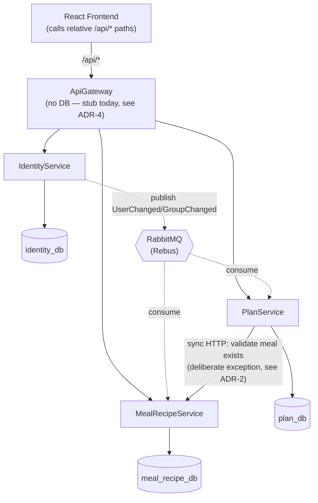
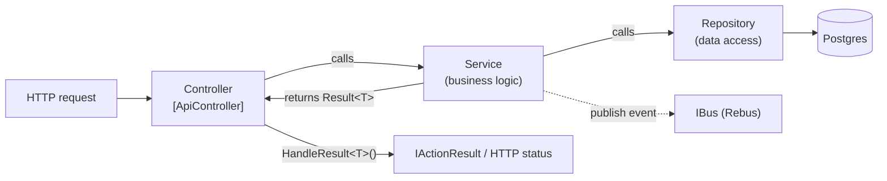
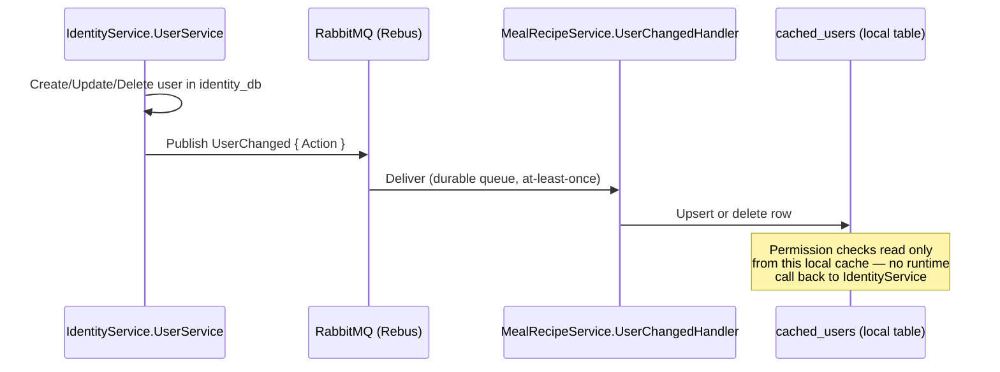
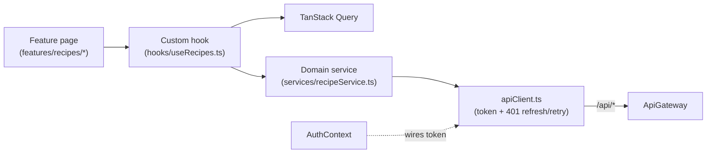

# Design Patterns

Patterns actually observed in this codebase, with file references. Patterns that look present from folder names but aren't implemented are called out explicitly so they aren't assumed later. Rationale below is grounded in this repo's own planning docs (`docs/plans/*.md`, `docs/notes.md`) where available, not invented after the fact.

---

## Architecture Diagrams

### System topology



### Backend request layering



### Event-driven cache sync (identity → downstream caches)



### Frontend layering



---

## Backend (.NET services)

### Repository pattern
Each DB-backed service (IdentityService, MealRecipeService, PlanService — not ApiGateway, which has no DB) defines an interface in `src/Interfaces` and a concrete implementation in `src/Repositories`, registered via DI.
- `services/IdentityService/src/Interfaces/IUserRepository.cs` + `services/IdentityService/src/Repositories/UserRepository.cs`
- `services/PlanService/src/Interfaces/IPlanRepository.cs` + `services/PlanService/src/Repositories/PlanRepository.cs`

MealRecipeService and PlanService add a caching decorator over repository-fetched identity data (`CachedRepository.cs` / `ICachedRepository`) — a lightweight decorator pattern rather than a plain repository.

### Service layer + Result pattern
Controllers only translate `Result<T>` into HTTP via a shared `HandleResult<T>()` on `BaseController.cs` (per-service). Services hold business logic and call repositories; repositories only do data access.
- `services/PlanService/src/Controllers/BaseController.cs` — `HandleResult<T>` switches on `result.Error.Type`.
- `services/IdentityService/src/Services/UserService.cs` — `CreateUserAsync` builds the domain entity, calls `_userRepository`, publishes via injected `IBus`.

`Result<T>` (`shared/Shared.Models/Result.cs`) is a functional result wrapper for explicit success/failure — not CQRS, and no MediatR is used anywhere in the repo.

### Dependency injection
Constructor injection, registered per-service in `Program.cs`:
- `AddScoped` for repositories/services (request-scoped)
- `AddSingleton` for `JwtSettings`, `TokenService`, `LookupCache`
- `AddHostedService` for background workers

Example: `services/IdentityService/src/Program.cs` — `AddScoped<IUserRepository, UserRepository>()`, `AddSingleton<ILookupCache, LookupCache>()`, `AddHostedService<LookupCacheWarmup>()`.

### Event-driven messaging (pub/sub)
Uses **Rebus** over RabbitMQ (not MassTransit) — `AddRebus(...).Transport(t => t.UseRabbitMq(...))` in each DB-backed service's `Program.cs`, with `AutoRegisterHandlersFromAssemblyOf<Program>()`.

Event contracts are records in `shared/Shared.Models/IdentityEvents.cs`: `UserChanged`, `GroupChanged`, `GroupMembershipChanged`, `CacheSyncRequested`. Consumers implement `IHandleMessages<T>`:
```csharp
public class GroupChangedConsumer(ICachedService _cachedService) : IHandleMessages<GroupChanged>
```
(`services/MealRecipeService/src/Consumers/GroupChangedConsumer.cs`)

Cache warm/sync on startup is handled by `IHostedService` workers (`HostedServices/CachedSyncHostedService.cs` in MealRecipeService/PlanService, `LookupCacheWarmup` in IdentityService) — a cache-warming pattern, not general CQRS.

### DTO / Contract separation
`Models/` holds EF entities (e.g., `IdentityService/src/Models/User.cs`); `Contracts/` holds request/response DTOs per service (e.g., `MealRecipeService/src/Contracts/RecipeDTO.cs`). Mapping is **manual**, not AutoMapper — no AutoMapper package reference exists. `MealRecipeService/src/Mappings/` exists as a directory but is currently empty; mapping is done inline via private static methods, e.g. `services/PlanService/src/Services/PlanningService.cs` — `private static PlanSummaryResponse ToDto(Plan plan) => new(...)`.

### API Gateway — not yet a reverse proxy
Despite the name, `ApiGateway` is not a YARP reverse proxy today. `services/ApiGateway/src/Program.cs` registers only health checks, controllers, and OpenAPI — no `AddReverseProxy()` or Yarp package. `GatewayController.cs` is a stub exposing `GET api/gateway/status`. Per `CLAUDE.md`, ApiGateway is meant to route without touching the DB — treat this as gateway/facade scaffolding, not a completed proxy. The frontend already calls relative `/api/*` paths (see `frontend/src/services/apiClient.ts`), i.e. the *contract* for a working gateway already exists even though the implementation doesn't yet — see the recommendations section.

### Not present
- **Options pattern** (`IOptions<T>`) — not used anywhere in `services/` or `shared/`. `JwtSettings` is bound with `builder.Configuration.GetSection("Jwt").Get<JwtSettings>()` and registered as a singleton POCO/record.
- **CQRS / MediatR** — no MediatR package anywhere in the repo.
- **Resilience policies (Polly)** — not present; no retry/circuit-breaker package reference found.
- **Outbox table** — not present; no `outbox`-named table or type found in SQL or C#.
- IdentityService additionally defines an `"InternalServiceOnly"` authorization policy checking an `X-Service-Key` header (service-to-service auth, not a general pattern).

## Frontend (React/TypeScript)

### Feature-based folders
`frontend/src/features/{auth,dashboard,meals,plans,recipes}` group page components and Zod schemas per domain (e.g., `features/recipes/RecipeFormPage.tsx`, `recipeSchema.ts`). Not fully self-contained, though: hooks and API services live centrally in `src/hooks` and `src/services` rather than per-feature.

### Context/Provider
One context, `frontend/src/contexts/AuthContext.tsx`, managing `{ user, isLoading, isAuthenticated }` plus `login/register/logout`, wired to `apiClient` via `setAccessToken`/`setUnauthorizedHandler`, exposed through `useAuth()`.

### Custom hooks over TanStack Query
`frontend/src/hooks/{useMealPlans,useMeals,usePlans,useRecipes}.ts` wrap `useQuery`/`useMutation` around the matching `services/*Service.ts` module, e.g. `useRecipes.ts`: `useQuery({ queryKey: queryKeys.recipes.all, queryFn: recipeService.list })`.

### Layered API client
A centralized low-level client, `frontend/src/services/apiClient.ts`, owns token storage and 401 refresh-and-retry logic, and calls relative `/api/*` paths. Per-domain modules (`authService.ts`, `mealService.ts`, `planService.ts`, `recipeService.ts`) sit on top of it.

### MSW for mocking
`frontend/src/mocks/handlers/index.ts` aggregates per-domain handler arrays (`authHandlers`, `recipeHandlers`, ...) built with MSW's `http`/`HttpResponse`, backed by fixtures in `mocks/fixtures/*.fixtures.ts`, wired up via `mocks/server.ts` (tests) and `mocks/browser.ts` (dev).

### Component composition
`frontend/src/components/ui/` holds simple presentational components (`Card.tsx`, `Button.tsx`, `Modal.tsx`, `Badge.tsx`). No compound-component pattern (no `Card.Header`/`Card.Body` sub-exports) — `Card.tsx` is a single default export with a `padding` variant prop. The container/presentational split is informal: feature pages act as containers (consume hooks), `components/ui` stays presentational. `ErrorBoundary` exists (`components/ErrorBoundary.tsx`, wired in `App.tsx`) — the standard React error-boundary pattern.

---

## Architectural Decision Rationale (ADR-style)

Each entry: Context → Decision → Consequences → Alternatives considered.

### ADR-1: Controller/Service/Repository layering with `Result<T>` instead of exceptions
- **Context:** Three services need consistent, predictable error → HTTP-status mapping (`CLAUDE.md` explicitly warns: *"Returning `Result<T>` [directly] causes all failures to respond with HTTP 200"*).
- **Decision:** Services return `Result<T>`; only `Controller.HandleResult<T>()` translates errors to status codes; repositories never see HTTP concerns.
- **Consequences:** (+) Failure paths are explicit in method signatures, not hidden in `try/catch`; status-code mapping is enforced in one place per service. (−) `BaseController.cs` is duplicated per service rather than shared from `Shared.Services`; every service method must remember to wrap its result.
- **Alternatives considered:** Exceptions + a global exception filter (rejected — easy to accidentally leak an unmapped exception as a raw 500); MediatR/CQRS pipeline behaviors for cross-cutting error handling (rejected as unnecessary indirection at this scale — no MediatR dependency exists).

### ADR-2: Database-per-service, with a deliberate synchronous exception for write-time validation
- **Context:** `docs/notes.md` records the shared-database setup was recognized as a **microservices anti-pattern**; `docs/plans/meal-planner-db-per-service-transition-plan.md` splits `mealplannerdb` into `identity_db`, `meal_recipe_db`, `plan_db` and removes cross-service FKs (e.g. `meal_plan.meal_id` becomes a plain `int`).
- **Decision:** Each service owns its schema exclusively; cross-service reads either go through the event-driven cache (ADR-3) or, where staleness is unacceptable, a direct synchronous HTTP call. `PlanService` calls `MealRecipeService` via `IMealRecipeServiceClient` to confirm a meal exists **before** inserting a `meal_plan` row, because an eventually-consistent cache could let a plan reference a meal that was just deleted.
- **Consequences:** (+) No accidental cross-service SQL joins; each schema evolves independently. (−) Referential integrity across service boundaries is no longer enforced by Postgres — `meal_plan.meal_id` can point at nothing unless application code checks it, which is exactly why the synchronous client exists. (−) That synchronous call reintroduces a runtime coupling (`PlanService` degrades if `MealRecipeService` is down) that the event-driven cache pattern was otherwise designed to avoid.
- **Alternatives considered:** Separate Postgres containers per service (rejected — no added isolation over separate logical DBs in one container, more ops overhead); keep the shared DB (rejected as the original anti-pattern being fixed).

### ADR-3: Event-driven local caches (Rebus/RabbitMQ) instead of synchronous calls for permission checks
- **Context:** `docs/plans/event-driven-identity-cache.md`: MealRecipeService/PlanService need user/group data to resolve permissions on every request, without calling IdentityService synchronously each time.
- **Decision:** IdentityService publishes `UserChanged`/`GroupChanged`/`GroupMembershipChanged`; consumers upsert into local `cached_*` tables; a `CacheSyncRequested` event supports full cache rebuilds (empty-cache-on-startup, or manual trigger) without new endpoints or deployments.
- **Consequences:** (+) Permission checks are local-DB-only — fast, and don't cascade-fail if IdentityService is down. (+) Reuses the same consumer code path for both incremental updates and full rebuilds. (−) Eventual consistency — a cache can be briefly stale right after an identity change. (−) Rebus requires each consumer to explicitly `bus.Subscribe<T>()` at startup (unlike MassTransit, which infers topology automatically) — the plan doc flags this as an easy silent-failure trap.
- **Alternatives considered:** MassTransit — was already wired into both `.csproj` files, but the plan doc notes MassTransit went **commercial at v9**, so it was replaced with the MIT-licensed Rebus before this pattern shipped. Synchronous HTTP per permission check — rejected as the runtime coupling this pattern exists to remove (see ADR-2 for the one place that coupling was kept deliberately).

### ADR-4: API Gateway as routing scaffold, not (yet) a reverse proxy
- **Context:** `CLAUDE.md` describes ApiGateway as proxying to downstream services with no DB connection; the frontend already calls relative `/api/*` paths as if such a proxy exists.
- **Decision (current state, not a deliberate final design):** `ApiGateway/src/Program.cs` only exposes health checks and a stub `GatewayController` — no YARP `AddReverseProxy()`. This looks like in-progress scaffolding rather than an intentional architectural choice.
- **Consequences:** (+) Nothing yet — no routing logic to get wrong. (−) The frontend's `/api/*` contract has no implementation behind it; something (currently unknown — a dev proxy? manual per-service base URLs?) must be filling this gap today. (−) Cross-cutting concerns (JWT validation, rate limiting) can't yet be centralized at the edge and are duplicated per service via `[Authorize]`.
- **Recommendation:** see below — this is the highest-leverage gap found during this review.

### ADR-5: Manual DTO mapping over AutoMapper
- **Context:** Services translate between EF entities (`Models/`) and wire contracts (`Contracts/`).
- **Decision:** Hand-written `private static ToDto(...)` methods per service, no AutoMapper dependency.
- **Consequences:** (+) No reflection-based mapping magic; renaming a field is a compile error, not a silent runtime null. (+) One fewer dependency to version. (−) Some mapping logic is duplicated across services with similar shapes; the `Mappings/` folder convention exists in MealRecipeService but is empty — the convention was started but not followed through.
- **Alternatives considered:** AutoMapper (not adopted).

### ADR-6: Layered frontend API access (apiClient → per-domain services → hooks)
- **Context:** The frontend needs consistent token/401-refresh handling plus typed, feature-specific calls that are easy to mock in tests.
- **Decision:** One low-level `apiClient.ts` owns token storage and refresh-and-retry; per-domain `*Service.ts` modules wrap it; custom hooks wrap those with TanStack Query; MSW handlers mirror the same per-domain split for tests.
- **Consequences:** (+) Auth/refresh logic lives in exactly one place. (+) Loading/error/cache state comes for free from TanStack Query rather than being hand-rolled per component. (−) Hooks and services are centralized rather than colocated inside `features/`, so a feature's full surface area isn't visible from its own folder — a deliberate trade against a "pure" feature-sliced layout.
- **Alternatives considered:** Fetch calls directly inside components (rejected — no place to centralize auth/refresh); fully feature-sliced hooks/services (not adopted; see recommendations).

---

## Recommendations: patterns worth adding

Ranked by leverage — how much risk they remove or confusion they resolve — not by effort.

### 1. Finish the API Gateway as a real YARP reverse proxy (highest leverage)
The frontend's `apiClient.ts` already assumes a single-origin `/api/*` gateway exists (ADR-4), but `ApiGateway/src/Program.cs` doesn't implement one. This is the one gap where the *contract* other layers depend on is already committed to, but the implementation isn't there — everything downstream (centralized JWT validation, rate limiting, single point for CORS) is blocked on it. Add `AddReverseProxy()` with a `ReverseProxy` config section routing `/api/auth/*` → identity-service, `/api/recipes/*` and `/api/meal/*` → meal-service, `/api/plan*` → plan-service.

### 2. Transactional outbox for identity event publishing
In `UserService.CreateUserAsync` (and similar), the DB write and `bus.Publish(...)` are two separate, non-atomic operations. If the process crashes or RabbitMQ is briefly unreachable between them, the DB commit succeeds but the event never ships — a classic dual-write bug — and downstream caches (ADR-3) silently drift until someone notices and triggers `CacheSyncRequested`. Writing the event to an `outbox` table in the *same* DB transaction as the entity change, with a background dispatcher draining it into Rebus, closes that gap and guarantees the cache-consistency property ADR-3 is designed around, rather than relying on drift going unnoticed until a manual rebuild.

### 3. Resilience policies (Polly) around the one synchronous cross-service call
ADR-2 documents `PlanService → MealRecipeService` (`IMealRecipeServiceClient`) as a deliberate exception to the event-driven pattern, specifically because it reintroduces runtime coupling. Today that call has no retry, timeout, or circuit breaker — a slow or restarting MealRecipeService will hang or fail every meal-plan creation. Since `IdentityServiceClient` follows the same `ServiceClient.CreateClient` pattern, a shared Polly policy (short timeout + retry-with-jitter + circuit breaker) applied at that one construction point would harden every inter-service HTTP call at once, not just this one.

### 4. Options pattern with startup validation (`IOptions<T>` + `ValidateOnStart()`)
`JwtSettings` and the RabbitMQ config are hand-bound via `GetSection(...).Get<T>()` with no validation. A misspelled key in a Docker Compose env var currently fails silently (null values flow into JWT signing or the RabbitMQ connection string) rather than failing at boot. Binding via `AddOptions<T>().Bind(...).ValidateDataAnnotations().ValidateOnStart()` is a small, low-risk change that converts a class of "works until a specific request path hits it" bugs into a clear startup crash — cheap relative to the other three.

**Not recommended:** CQRS/MediatR — the services are CRUD-shaped with few distinct commands per aggregate; the layering ADR-1 already provides is doing the job MediatR pipeline behaviors would otherwise add, without the extra indirection.
